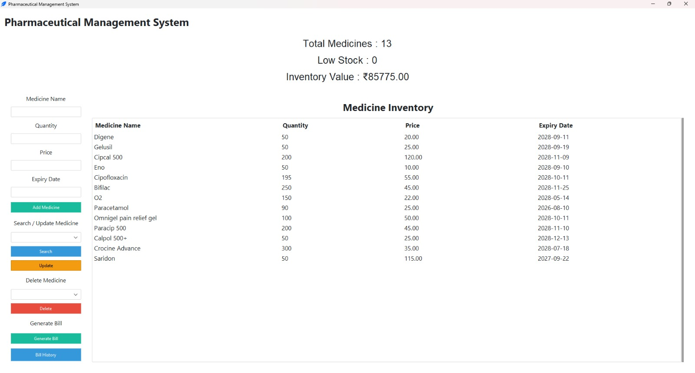
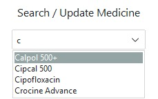
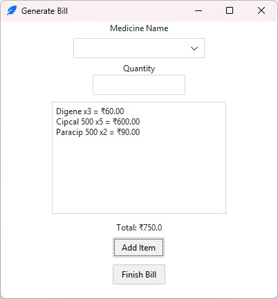
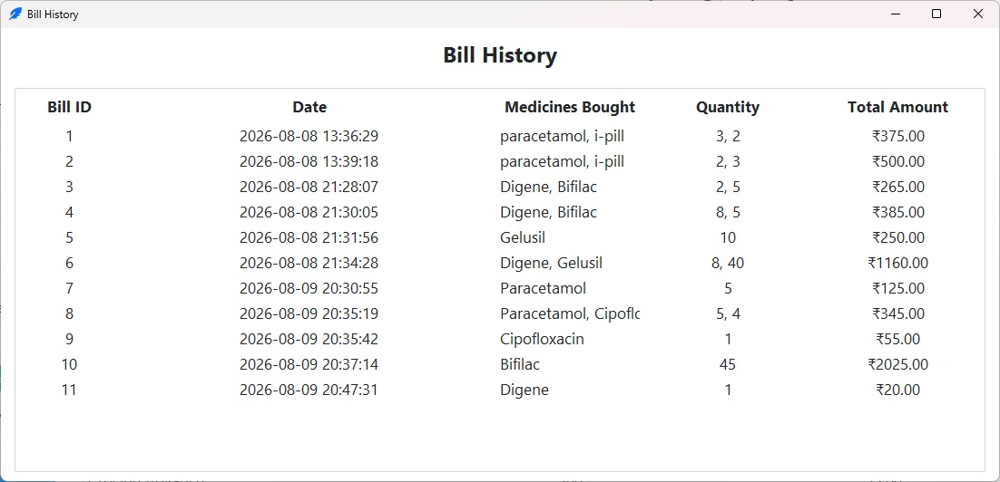
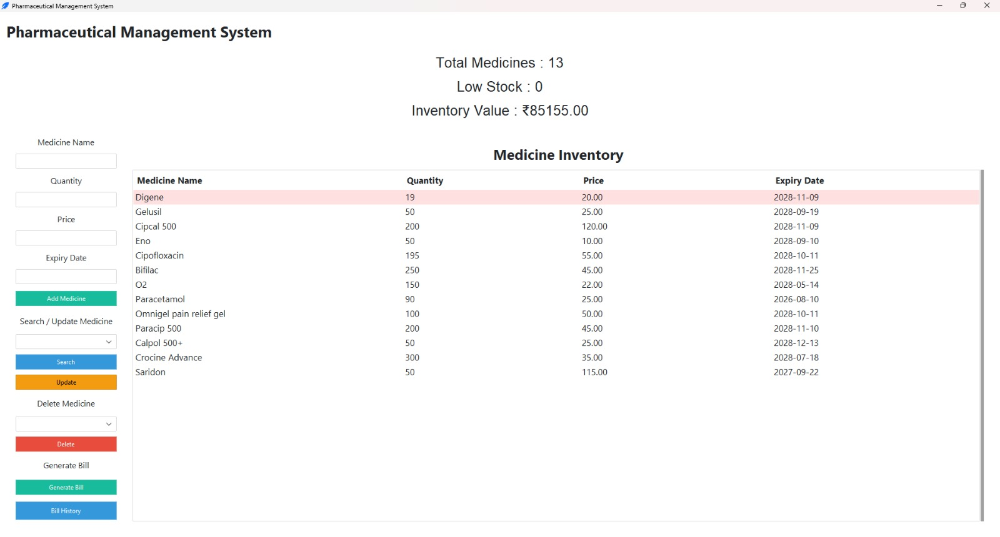
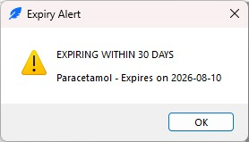

# Pharmaceutical Management System

A desktop-based pharmaceutical inventory and billing management system built with Python and MySQL.

The application helps manage medicines, track inventory, generate bills, monitor stock levels, and identify medicines that are expired or nearing expiry.

## Features

- Medicine inventory management
- Add, search, update, and delete medicines
- Medicine name autocomplete
- Low-stock monitoring
- Inventory value calculation
- Expiry and upcoming-expiry alerts
- Billing system
- Automatic stock deduction after successful billing
- Transaction-safe billing with rollback support
- Bill history
- MySQL database integration
- Environment-based database configuration
- Modular database architecture

## Technologies Used

- Python
- Tkinter / ttkbootstrap
- MySQL
- MySQL Connector/Python
- python-dotenv

## Project Structure

```text
medical-store-management-system/
│
├── .env.example
├── .gitignore
├── billing_db.py
├── db_connection.py
├── main.py
├── medicine_db.py
├── requirements.txt
└── schema.sql
## Screenshots
```
## Screenshots

### Main Dashboard

<p align="center">
  
</p>

### Application Features

<p align="center">
  
  
</p>

<p align="center">
  
  
</p>

<p align="center">
  
</p>
